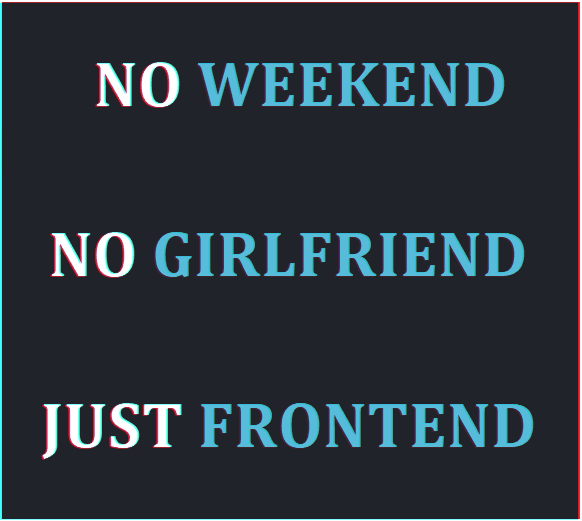

# 𝐇𝐢, 𝐥𝐨𝐯𝐞𝐥𝐲 𝐭𝐨 𝐬𝐞𝐞 𝐲𝐨𝐮! 

               

---

<!-- add &layout=compact when it will be a lot of langs -->

        

---

## 𝐋𝐚𝐧𝐠𝐮𝐚𝐠𝐞𝐬 𝐚𝐧𝐝 𝐭𝐨𝐨𝐥𝐬:

<code></code>
<code></code>
<code></code>

<!-- https://igtype.onhype.site/ font№37 -->

